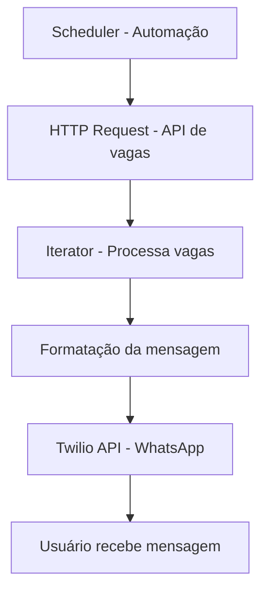
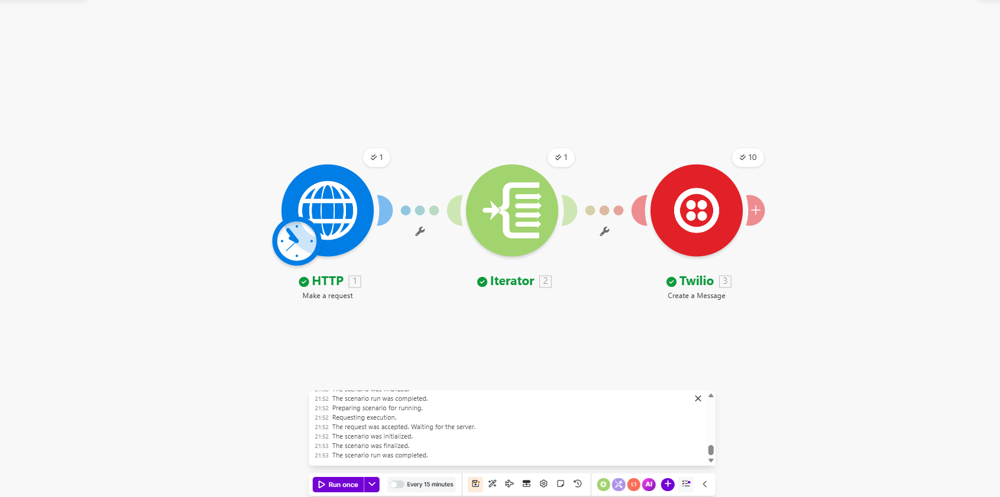
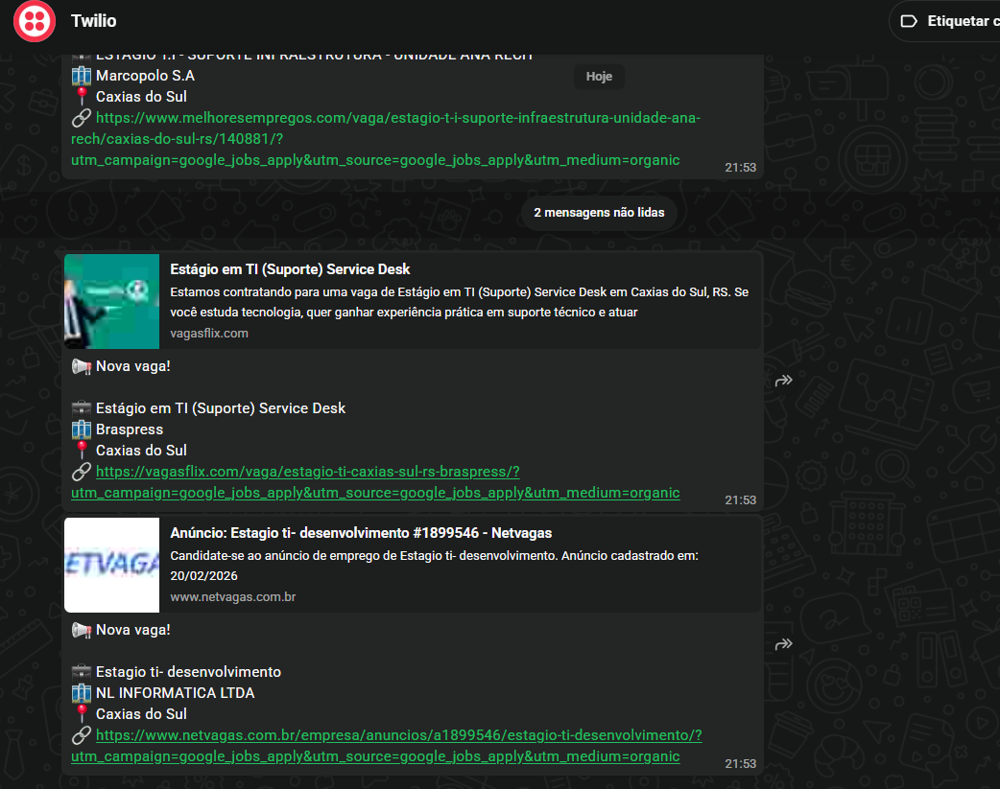

# 🚀 Bot de Vagas no WhatsApp

Automação que coleta vagas de estágio via API e envia notificações automaticamente pelo WhatsApp.

---

## 💡 Descrição

Este projeto consiste em um fluxo automatizado que busca vagas de estágio com base em palavras-chave e localização, processa os resultados e envia mensagens diretamente para o WhatsApp do usuário.

A solução foi construída utilizando uma plataforma de automação para integrar múltiplos serviços sem necessidade de backend próprio.

---

## 🧠 Arquitetura



## 📘 Explicação da Arquitetura

Make (Trigger) → inicia a automação (manual ou agendada)
HTTP Request → consome a API de vagas via RapidAPI
Iterator → percorre cada vaga individualmente
Formatter → monta a mensagem formatada
Twilio API → envia a mensagem para o WhatsApp
Usuário → recebe as vagas automaticamente

## 🔁 Fluxo da Automação

A automação é disparada manualmente ou por agendamento
O sistema realiza uma requisição HTTP para a API de vagas
Os dados retornados são iterados individualmente
Cada vaga é formatada em uma mensagem
A mensagem é enviada via WhatsApp
O usuário recebe as vagas automaticamente

## 🧩 Tecnologias Utilizadas

Make → Orquestração da automação
RapidAPI → Consumo da API de vagas
Twilio → Envio de mensagens via WhatsApp
HTTP Requests → Integração com serviços externos


## 📸 Demonstração
🔹 Fluxo no Make


🔹 Mensagem no WhatsApp

```markdown


